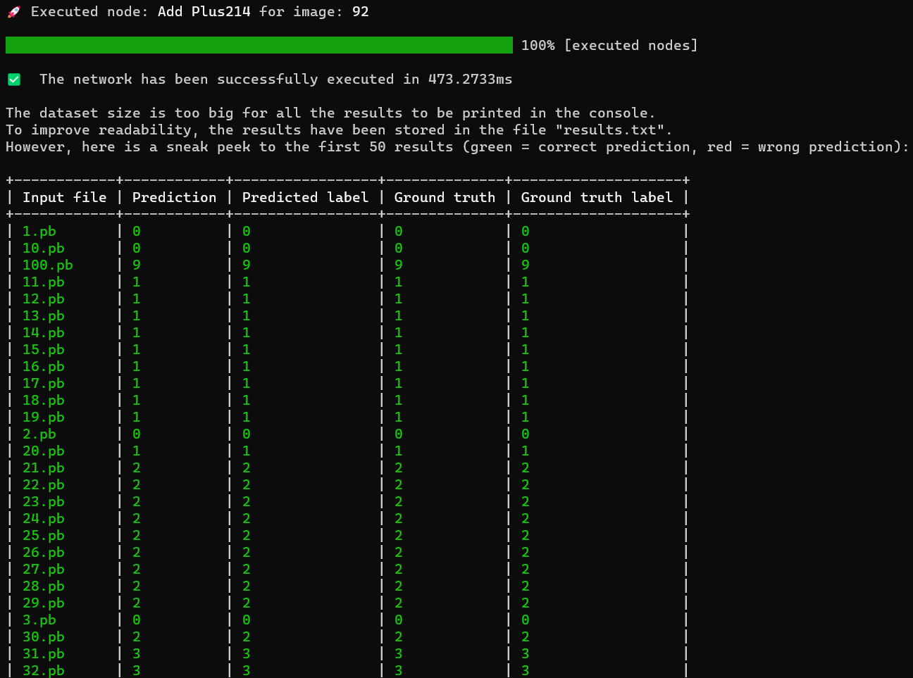

<a id="top"></a>

<div align="center">

  # RustONNX

  <p align="center">
    
    <br/>
    <br/>
    A fast and easy to extend Rust-based ONNX inference engine. ⚙️
</p>
</div>

<details>
  <summary>Table of Contents</summary>
  <ol>
    <li><a href="#about-the-project">❓ About the project</a>
      <ul>
        <li><a href="#features">💡 Features</a></li>
        <li><a href="#getting-started">🏃 Getting started</a>
          <ul>
            <li><a href="#cloning-the-repo">Cloning the repo</a></li>
            <li><a href="#requirements">Requirements</a></li>
            <li><a href="#build-run-rustonnx">Build & run RustONNX</a></li>
          </ul>
        </li>
        <li><a href="#step-by-step-execution">👟 Step by step execution</a></li>
        <li><a href="#project-structure">📂 Project structure</a></li>
        <li><a href="#supported-models">🧠 Supported models</a></li>
        <li><a href="#supported-operators">➗ Supported operators</a></li>
        <li><a href="#supported-datasets">🖼️ Supported datasets</a></li>
      </ul>
    </li>
    <li><a href="#the-core-of-rustonnx">🪬 The core of RustONNX</a>
<ul>
        <li><a href="#trait-operator">📌 Trait Operator</a>
        </li>
        <li><a href="#rayon-powered-parallelization">🚀 Rayon-powered parallelization</a></li>
        </li>
</ul>
    <li><a href="#python-bindings">🐍 Python bindings</a>
      <ul>
        <li><a href="#setup-of-python-binding">⚒️ Setup of Python binding</a></li>
        <li><a href="#exported-functions">📩 Exported functions</a></li>
      </ul>
    </li>
    <li><a href="#how-to-extend-the-project">➕ How to extend the project</a>
      <ul>
        <li><a href="#extending-with-a-new-operator">➗ Extending with a new operator</a></li>
        <li><a href="#extending-with-a-new-model">🧠 Extending with a new model</a></li>
        <li><a href="#extending-with-a-new-dataset">🖼️ Extending with a new dataset</a></li>
      </ul>
    </li>
    <li><a href="#useful-resources">🔗 Useful resources</a></li>
    <li><a href="#contributing">🫂 Contributing</a></li>
    <li><a href="#license">📜 License</a></li>
    <li><a href="#authors">🤝 Authors</a></li>
    <li><a href="#acknowledgments">🙏 Acknowledgments</a></li>
  </ol>
</details>

<h2 id="about-the-project">❓ About the project</h2>

<h3 id="features">💡 Features</h3>

* 🕹️ User-friendly menu based on the [dialoguer crate](https://docs.rs/dialoguer/latest/dialoguer/). 
* 🥷 Under the hood .onnx and .pb parser to load ONNX models and protobuf data.
* 📦 Delivered with a set of validated operators, models and datasets. 
* 🦜 Network inference can be performed in both verbose and non-verbose mode.
* ➕ Easy to add new operators to extend model compatibility.
* 🖼️ Images & labels serialization to extend the set of available datasets.
* 🚀 [Rayon](https://docs.rs/rayon/latest/rayon/)-powered image-based and intra-network parallelization.
* 🐍 Python bindings for a complete Rusty experience.

<p align="right">(<a href="#top">back to top</a>)</p>

<h3 id="getting-started">🏃 Getting started</h3>

<h4 id="cloning-the-repo">Cloning the repo</h4>

We recommend [connecting to GitHub with SSH](https://docs.github.com/en/authentication/connecting-to-github-with-ssh). 

After the setup, it will be possible to clone the repo by doing:
```
git clone git@github.com:claudiotancredi/RustONNX.git
```

##### :warning: Attention to spaces in project path
Depending on the Rust toolchain you decide to use, please be aware that you may experience build-time errors caused by spaces in the project path.

To avoid any build issues, it's recommended to clone or place the project in a directory without spaces in its path.

<p align="right">(<a href="#top">back to top</a>)</p>

<h4 id="requirements">Requirements</h4>

To run the project, you need to have [rustup](https://rustup.rs/) installed on your PC.

<p align="right">(<a href="#top">back to top</a>)</p>

<h4 id="build-run-rustonnx">Build & run RustONNX</h4>

After cloning the repo, you can run our application by doing:
```
cd RustONNX/rust-onnx
cargo run
```
If everything goes smoothly, an interactive menu will appear to let you decide how to perform inference.

<p align="right">(<a href="#top">back to top</a>)</p>

<h3 id="step-by-step-execution">👟 Step by step execution</h3>
Let's see the flow when executing our RustONNX.


<p align="center">
    
    <br/>
    At first, you will see this interactive menu. Let's choose MNIST for simplicity.
</p>
<p align="center">
    
    <br/>
    We'll be asked for the dataset to perform the inference on. Let's go with a custom dataset.
</p>
<p align="center">
    
    <br/>
    We'll be asked for the folder name of the custom dataset. Let's use the provided custom dataset, so our input should be "dataset".
</p>
<p align="center">
    
    <br/>
    We'll be asked for the mode: verbose or non-verbose. We'll go with non-verbose this time.
</p>
<p align="center">
    
    <br/>
    RustONNX will keep us updated about the runtime status for the different operations (model loading, serialization if any, dataset loading, model optimization for intra-network parallel execution). At the end, some general info will be printed in a tabular way and the execution in non-verbose mode will start. 
</p>
<p align="center">
    
    <br/>
    When finished, the network will display some info: execution time and results for each input image. In this case, the limit of 50 images has been exceeded, so we can only see a sneak peek. The complete table has been stored in the results.txt file.
</p>
<p align="center">
    
    <br/>
    After the table, error rate and accuracy will be printed too, also in the results.txt file.
</p>
<p align="center">
    
    <br/>
    Now, just to give you a hint, this is what the execution in verbose mode looks like. As you can see, the difference with the non-verbose mode is that here also the names and the shapes of inputs, initializers and outputs are displayed in a pretty and colorful table.
</p>


<p align="right">(<a href="#top">back to top</a>)</p>


<h3 id="project-structure">📂 Project structure</h3>

Here is an overview of the project structure with the most important folders & files, along with some useful information.

```
RustONNX
├───images                              //Assets for README.md
└───rust-onnx
    ├───models                          //Folder where supported models are located
    │   ├───mnist-12
    │   ├───mobilenet-v2-7
    │   │   ├───dataset                 //Sample custom ImageNet-like dataset
    │   │   │   ├───566                 //Each folder contains images associated with the label given by the folder name
    │   │   │   ├───569
    │   │   │   ├───571
    │   │   │   ├───574
    │   │   │   └───701
    │   │   ├───dataset_serialized      //Generated at run-time via serialization on the sample custom dataset
    │   │   ├───test_data_set_0         //Test dataset provided by ONNX
    |   |   └───model.onnx              //.onnx file for the model
    │   ├───resnet18-v1-7
    │   └───resnet34-v2-7
    ├───protos                          //.proto3 files used at build-time
    ├───py_rust_onnx                    
    │   ├───python-binding              //Python virtual environment folder generated while doing the setup for the binding
    │   └───test.py                     //Python demo for binding
    ├───src
    │   ├───datasets                    //Dataset related functions and data structures
    │   ├───models                      //Models related functions and data structures
    │   ├───onnx_parser
    │   │   ├───protoc_generated        //Generated at build-time using protoc. Parser modules.
    │   │   └───parser.rs               //ONNX parser functions
    │   ├───operators                   //Operators implementation
    │   ├───utils                       //Generic utilities module (metrics, errors, menu, execution serialization, etc.)
    │   │   ├───auxiliary_functions.rs
    │   │   ├───errors.rs
    │   │   ├───menu.rs                  
    │   │   ├───run.rs
    │   │   ├───serialization_utils.rs
    │   │   └───shared_constants.rs
    │   ├───lib.rs                      //Used for Python bindings
    │   └───main.rs         
    ├───build.rs
    ├───Cargo.lock
    ├───Cargo.toml
    └───results.txt                     //Generated at run-time. Execution results when the dataset has # images > 50
```

The folder `RustONNX/rust-onnx/src/operators/` should be your single-point-of-change-in-code (SPOCIC) when implementing new operators.  
The folders `RustONNX/rust-onnx/src/models/` and `RustONNX/rust-onnx/src/datasets/` should be your SPOCICs when adding new models that are compatible with new datasets.

The folder `RustONNX/rust-onnx/models/` is where ONNX models and datasets must reside.


<p align="right">(<a href="#top">back to top</a>)</p>

<h3 id="supported-models">🧠 Supported models</h3>

Reference: [ONNX Model Zoo](https://github.com/onnx/models)

| Model name           | Description                                                                        | Version | Opset version |
| -------------------- | ---------------------------------------------------------------------------------- | ------- | ------------- |
| **mnist-12**         | Handwritten digits recognition model specifically designed for the MNIST dataset.  | N/A     | 12            |
| **resnet18-v1-7**    | Image classification model with 18 layers for ImageNet-like datasets.              | 1       | 7             |
| **resnet34-v2-7**    | Image classification model with 34 layers for ImageNet-like datasets.              | 2       | 7             |
| **mobilenet-v2-7**    | Efficient and lightweight image classification model for ImageNet-like datasets.   | 2       | 7             |

#### :warning: ONNX Model Zoo is undergoing some changes
During the development of this project, the [ONNX Model Zoo](https://github.com/onnx/models) was being expanded by incorporating additional models. Since new models had not been validated yet, the models supported by our RustONNX were taken from the set of _validated_ networks.

Please, be aware that new models may be more performant and that old models, included the ones supported by our RustONNX, may be deleted in future updates of the ONNX Model Zoo.

<p align="right">(<a href="#top">back to top</a>)</p>

<h3 id="supported-operators">➗ Supported operators</h3>

Reference: [ONNX Operators](https://onnx.ai/onnx/operators/)

| Operator             | Version | Description                                                                                                                                                                                                                                                                                               | 
|----------------------|:-------:|:----------------------------------------------------------------------------------------------------------------------------------------------------------------------------------------------------------------------------------------------------------------------------------------------------------|
| Add                  |   14    | Performs element-wise binary addition (with Numpy-style broadcasting support).                                                                                                                                                                                                                            |
| BatchNorm            |   15    | Carries out batch normalization as described in the paper https://arxiv.org/abs/1502.03167.                                                                                                                                                                                                               |
| Convolution          |   11    | The convolution operator performs the convolution given an input tensor and a filter, and computes the output. RustONNX provides the optimized version whose [Python implementation](https://github.com/onnx/onnx/blob/main/onnx/reference/ops_optimized/op_conv_optimized.py) can be found here.                                                                                                                                                                                    |
| Flatten              |   21    | Flattens the input tensor into a 2D matrix. If input tensor has shape (d_0, d_1, … d_n) then the output will have shape (d_0 X d_1 … d_(axis-1), d_axis X d_(axis+1) … X dn).                                                                                                                             |
| Gemm                 |   13    | General Matrix multiplication: https://en.wikipedia.org/wiki/Basic_Linear_Algebra_Subprograms#Level_3<br>A’ = transpose(A) if transA else A <br>B’ = transpose(B) if transB else B<br>Compute Y = alpha * A’ * B’ + beta * C                                                                                 |
| GlobalAveragePooling |    1    | Given an input tensor X, applies average pooling across the values in the same channel.                                                                                                                                                                                                  |
| MatMul               |   13    | Matrix product that behaves like numpy.matmul: https://numpy.org/doc/stable/reference/generated/numpy.matmul.html                                                                                                                                                                         |
| MaxPool              |   12    | Given an input tensor X, applies max pooling across the tensor according to kernel sizes, stride sizes, and pad lengths. Max pooling consists of computing the max on all values of a subset of the input tensor according to the kernel size and downsampling the data into the output tensor Y for further processing. |
| ReLU                 |   14    | Relu takes one input data (Tensor) and produces one output data (Tensor) where the rectified linear function, y = max(0, x), is applied to the tensor elementwise.                                                                                                                                        |
| Reshape              |   21    | Reshape the input tensor similar to numpy.reshape. First input is the data tensor, second input is a shape tensor which specifies the output shape. It outputs the reshaped tensor.    

<p align="right">(<a href="#top">back to top</a>)</p>

<h3 id="supported-datasets">🖼️ Supported datasets</h3>

For all models supported by RustONNX, two sample datasets are provided:

1. a test dataset provided by ONNX, placed in `RustONNX/rust-onnx/models/<model_to_run>/test_data_set_0/`, with an image and a label already serialized into .pb files. The datasets validated by ONNX are especially useful when implementing new operators to extend the model compatibility of RustONNX.
2. a custom dataset, placed in `RustONNX/rust-onnx/models/<model_to_run>/dataset/`, with .jpg, .jpeg or .png images to be serialized into .pb files, on which the network will be executed. Thanks to the serialization feature of RustONNX, you can smoothly perform inference on your own datasets. But if you're lazy and just want to test the feature, at least we've got you covered! 🦥

<p align="right">(<a href="#top">back to top</a>)</p>

<h2 id="the-core-of-rustonnx">🪬 The core of RustONNX</h2>

<h3 id="trait-operator">📌 Trait Operator</h3>

The foundation of our project is encapsulated in the `Operator` trait, which outlines the essential capabilities each operator must provide.
Here is the list of functions to implement.
```rust 
fn execute(&self, inputs: &HashMap<String, ArrayD<f32>>) -> Result<Vec<ArrayD<f32>>, OnnxError>;
``` 
The execute contains the logic of the operator. It accepts a `&HashMap<String, ArrayD<f32>>` where the key is the name of the input of the network or the name of a previously executed node, and the value is the associated data/output. It returns a `Result<Vec<ArrayD<f32>>, OnnxError>`, which either yields a vector of multi-dimensional arrays 
upon success or an OnnxError in case of failure.
```rust 
fn to_string(&self, inputs: &HashMap<String, ArrayD<f32>>, outputs: &Vec<ArrayD<f32>>, image_index: String) -> String;
```
This is used during the run in verbose mode. This method provides descriptive information about the inputs, initializers, outputs and the image being processed, for a specific node. It takes a `&HashMap<String, ArrayD<f32>>` and a `Vec<ArrayD<f32>>` as inputs, along with an 
image index of type `String` that represents the index of the image that the model is currently performing inference on. It returns a `String` that can be printed on the console.

```rust 
fn get_inputs(&self) -> Vec<String>;
fn get_output_names(&self) -> Vec<String>;
fn get_node_name(&self) -> String;
fn get_op_type(&self) -> String;
fn get_initializers_arr(&self) -> Vec<Initializer>;
``` 
In this order:
* Returns a `Vec<String>` listing the names of the inputs.
* Provides a `Vec<String>` with the names of the operator's outputs. 
* Returns a `String` containing the operator's node name.
* Returns a `String` containing the type of the operator (e.g. "Conv").
* Retrieves a `Vec`, which contains the initializers associated with the node, if any.

```rust 
fn clone_box(&self) -> Box<dyn Operator>;
``` 
This function is essential for Python bindings. It returns a `Box<dyn Operator>`, enabling the cloning of operator instances.

<p align="right">(<a href="#top">back to top</a>)</p>

<h3 id="rayon-powered-parallelization">🚀 Rayon-powered parallelization</h3>

The [rayon crate](https://docs.rs/rayon/latest/rayon/) has been used to implement both an image-based and an intra-network parallelization.

The image-based parallelization is trivial: when loading different .pb files, where each represents an image, the inference on these images will be performed in parallel. 

As for the intra-network parallelization, different strategies could be investigated. Our RustONNX employs an initial processing of the network to optimize it for the subsequent execution. This process can be divided into two steps:
1. creation of a graph structure using the [petgraph crate](https://docs.rs/petgraph/latest/petgraph/). This is done to ease the analysis of the network architecture;
2. graph traversal to collect the nodes belonging to the same _layers_. A layer is a subset of nodes that don't show any dependencies and can, therefore, run in parallel. 

Let's do an example. The `MNIST (opset-version=12)` architecture is:

<p align="center">
  
</p>

The result of the initial optimization on `MNIST (opset-version=12)` is:

```
[["Convolution28", "Times212_reshape1"], ["Plus30"], ["ReLU32"], ["Pooling66"], ["Convolution110"], ["Plus112"], ["ReLU114"], ["Pooling160"], ["Times212_reshape0"], ["Times212"], ["Plus214"]]
```

Indeed, the nodes with names `Convolution28` and `Times212_reshape1` can run in parallel.


<p align="right">(<a href="#top">back to top</a>)</p>

<h2 id="python-bindings">🐍 Python bindings</h2>

RustONNX provides Python bindings using the [maturin crate](https://docs.rs/maturin/latest/maturin/) and the [PyO3 library](https://pyo3.rs/v0.20.2/). This way, if you want to work in the Python environment you can still benefit from Rust's performance. 

<h3 id="setup-of-python-binding">⚒️ Setup of Python binding</h3>

To ensure a smooth testing experience of our Python bindings, we advise using a virtual environment.
Below are the instructions to set up and activate a Python virtual environment. After setting up the environment, you will be able to run the example file we have provided to demonstrate the usage of our binding.
1. Create the virtual environment:
    ```bash
    cd rust-onnx
    python3 -m venv ./py_rust_onnx/python-binding/
    ```
2. Activate the virtual environment:
    - For Linux and macOS:
        ```bash
         source py_rust_onnx/python-binding/bin/activate
        ```
    - For Windows:
      ```bash
      .\py_rust_onnx\python-binding\Scripts\activate
      ```
3. Install the necessary packages:
    ```bash
    pip install maturin numpy
    ```
4. Build the Rust code and install it:
    ```bash
    maturin develop --release
    ```
5. Run our Python script to test the binding:
    ```bash
    python3 ./py_rust_onnx/test.py
    ```

<p align="right">(<a href="#top">back to top</a>)</p>

<h3 id="exported-functions">📩 Exported functions</h3>

The exported Rust functions are encapsulated in a module called `rust_onnx_lib`, that you can import as:
```python
    import rust_onnx_lib
```

Here are the 5 exported functions:


```rust 
    pub fn py_load_model(_py: Python, file_path_str: String) -> PyResult<(PyModel, String, String)> 
```
This function loads the ONNX model from the provided path and returns the model, the expected name for the input of the network and the name of the final node of the network.
```rust 
    pub fn py_serialize_custom_dataset(_py: Python, model_id: usize,  dir_path: String) -> PyResult<()>
```
If a custom dataset is selected to infer on, this function performs the serialization of images and labels into .pb files that can then be loaded by the framework.
```rust 
    pub fn py_load_images_and_labels(py: Python, model_id: usize, folder_name: String, test_dataset: bool) 
                                     ->PyResult<(PyObject, PyObject, Vec<String>)>
```
This function retrieves and loads the images and the labels of the selected dataset, returning the images data, the labels data and a vec containing the file paths of the loaded .pb files.
```rust 
    pub fn py_run_model(py:Python, inputs: Vec<PyObject>, model: &PyModel, input_name: String, 
                          verbose: bool, final_layer_name: String, id_model: usize)
                                      -> PyResult<PyObject>

```
This is the core function of the framework. It runs the model returning the final output of the network.
```rust 
    pub fn py_print_results (py: Python, model_id: usize, files: Vec<String>, model_output: PyObject,
                                      labels: PyObject) -> PyResult<()>
```
This last function allows displaying the result of the network for each input image, along with global metrics, such as accuracy and error rate.
  
<p align="right">(<a href="#top">back to top</a>)</p>

<h2 id="how-to-extend-the-project">➕ How to extend the project</h2>

<h3 id="extending-with-a-new-operator">➗ Extending with a new operator</h3>

To integrate a new operator into our framework, you can follow these steps into the SPOCIC directory `operators/`:

1. **Create a new file**: generate a new Rust source file (`.rs`) within the `operators/` directory. This file will contain your operator's implementation.

2. **Export the operator**: update the `mod.rs` file in the `operators/` folder to export your new operator, making it accessible to other parts of the project.

3. **Edit create_operator() function**: the function is located within the `operators.rs` file and you should add a new arm, for your new operator, to the existing match, as done for the others.


Each operator must adhere to the `Operator` trait, which outlines essential functionalities. Your operator should implement the following methods:

- `execute()`: defines the core logic for the operator;
- `get_inputs()`: returns a `Vec<String>` listing the names of the inputs;
- `get_output_names()`: provides a `Vec<String>` with the names of the outputs;
- `get_node_name()`: gives back a `String` with the operator's node name;
- `get_op_type()`: delivers a `String` specifying the operator's type;
- `get_initializers_arr()`: retrieves a `Vec`, which contains any initializers associated with the node;
- `clone_box()`: this method is necessary for creating Python bindings.

By following these specifications, you ensure that the new operator is compatible with our framework.

<p align="right">(<a href="#top">back to top</a>)</p>

<h3 id="extending-with-a-new-model">🧠 Extending with a new model</h3>

To add a new model to our project, follow these organized steps carefully:

#### Step 1: Create model directory

- Navigate to `rust-onnx/models/`.
- Create a new folder named after your model.

#### Step 2: Add ONNX model and test data

Inside your model's folder, you should include:

- The ONNX model file renamed to `model.onnx`.
- A subfolder named `test_data_set_0` which will contain the following files provided by ONNX:
    - `input_0.pb`: the input protobuf file.
    - `output_0.pb`: the output protobuf file.

In a following section you'll know more about the possibility of adding a new dataset.

#### Step 3: Register the model in RustONNX
Here your SPOCIC is the `src/models/` folder.

- Open the file `src/models/models.rs`.
- Update the constant `MODELS_NAMES` with the name of your new model.
- Add a new variant to the `Model` enum representing your model.
- Extend the methods of the Model enum implementation with the new alternative.

By following these steps, you'll successfully integrate a new model into our framework.

<p align="right">(<a href="#top">back to top</a>)</p>

<h3 id="extending-with-a-new-dataset">🖼️ Extending with a new dataset</h3>

It is possible to run a network on a new dataset, provided that the latter conforms to some rules:
* the dataset folder must be placed under the folder of the model you want to run (e.g. `models/mnist-12/my-dataset/`);
* the dataset folder must include subfolders whose names match the label, in numeric format, of the images they contain;
* at least one subfolder that follows the naming convention mentioned above must reside within the dataset folder;
* accepted image formats are .jpg, .jpeg or .png;
* all subfolders following the expected naming convention (i.e. label in numeric format) must include at least a .jpg, .jpeg or .png file.

For example, you may have a `"my-dataset/"` folder under `"resnet18-v1-7/"` with a `"207/"` subfolder that includes a .jpg, .jpeg or .png image of a golden retriever, since 207 is the label for a golden retriever in the ImageNet dataset.

There are a few other things you must check before going wild with your images. Here your SPOCIC is the `src/datasets/` folder:
* if the dataset classes are different from the ones in MNIST and ImageNet, you should provide the mapping of the labels in the file `label_mappings.rs`;
* if you're also going to run a new model on these images, you may want to check the [ONNX Model Zoo](https://github.com/onnx/models/tree/main) documentation and, if required by the model, add a new serialization function for the new dataset. You can do it in the `images_serialization.rs` file.


<p align="right">(<a href="#top">back to top</a>)</p>

<h2 id="useful-resources">🔗 Useful resources</h2>

* [ONNX Model Zoo](https://github.com/onnx/models/tree/main)
* [ONNX Operators](https://onnx.ai/onnx/operators/)
* [Netron](https://netron.app/)
* [protobuf_codegen crate](https://docs.rs/protobuf-codegen/latest/protobuf_codegen/)
* [ndarray crate](https://docs.rs/ndarray/latest/ndarray/)
* [rayon crate](https://docs.rs/rayon/latest/rayon/) 
* [maturin crate](https://docs.rs/maturin/latest/maturin/)
* [PyO3 user guide](https://pyo3.rs/v0.20.2/)

<p align="right">(<a href="#top">back to top</a>)</p>

<h2 id="contributing">🫂 Contributing</h2>

Contributions are what make the open source community such an amazing place to learn, inspire, and create. Any contributions you make will benefit everybody else and are **greatly appreciated**.

If you're interested in opening an issue, please be sure to make it:

* _Scoped to a single topic_. One topic per issue.
* _Specific_. Include as many details as possible. 
* _Unique_. Do not duplicate existing opened issues: **search for the topic you're interested in before creating any issues**.
* _Reproducible_. If you're reporting a problem, include the necessary steps to reproduce it.

If you have a suggestion that would make this better, please fork the repo and create a pull request.

Don't forget to give the project a star! Thanks again!

<p align="right">(<a href="#top">back to top</a>)</p>


<h2 id="license">📜 License</h2>

Distributed under the MIT License. See `LICENSE` for more information.

<p align="right">(<a href="#top">back to top</a>)</p>

<h2 id="authors">🤝 Authors</h2>

- [Claudio Tancredi](https://github.com/claudiotancredi/)
- [Francesca Russo](https://github.com/frarus)

<p align="right">(<a href="#top">back to top</a>)</p>

<h2 id="acknowledgments">🙏 Acknowledgments</h2>

RustONNX is delivered with sample custom datasets:

* for MNIST, images are sourced from [MNIST-JPG](https://github.com/teavanist/MNIST-JPG);
* for models that work on ImageNet-like datasets, images are sourced from [Imagenette](https://github.com/fastai/imagenette) and are licensed under the Apache License 2.0.

<p align="right">(<a href="#top">back to top</a>)</p>
